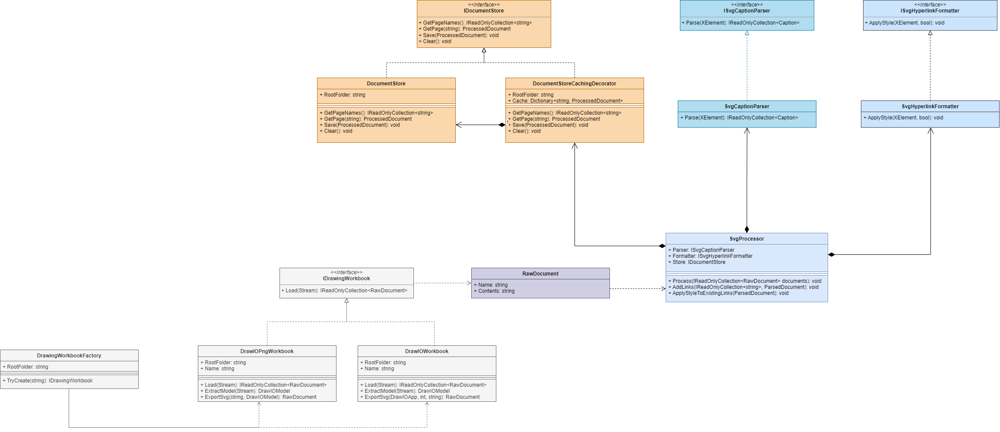
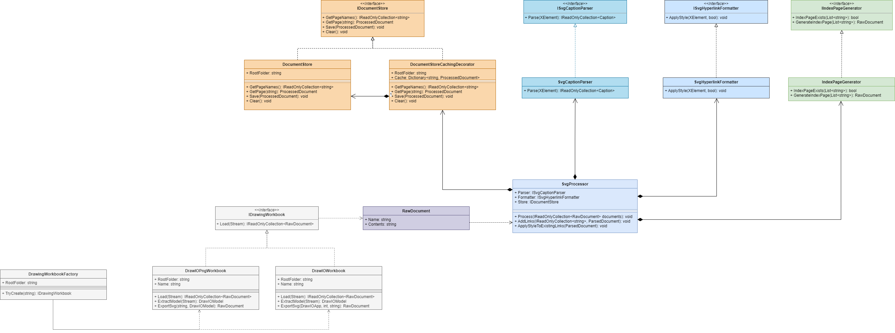

# Challenge - Option B - Develop a Feature

I worked on the feature request "Automatic generation of start page" for Planion.DrawVista OTS. 
https://github.com/plainionist/Plainion.DrawVista/issues/1 

## Project/Repository
The project is an OTS (Off-The-Shelf) software named "Planion.DrawVista" a Browser for interactive diagrams based on Draw.IO. The project is hosted on GitHub at https://github.com/plainionist/Plainion.DrawVista.

## Problem Statement:
The start page (the SVG called "index") currently needs to be hand crafted. It should be generated automatically to save the manual effort. 

## Solution/Feature:
The start page shall be generated automatically by the system by creating a graph.
- showing a "node" for each page existing in the system
- showing a directed edge from each page (node) to those pages (nodes) mentioned within this page

### How did you approach the problem? (diagrams, documents, backlog, …)

#### Issues faced:
- There was very little documentation available for the project. 
- There was no documentation about the architecture and design so it was difficult to get the design overview without reading the complete code and understanding the existing structure.		
- The depedendencies were mismatching and not updated and the project was not building successfully.
- It was hard to install the npm packages as they were not avaialble in the private npm registry so I had to switch to npm public registry to install the packages.
- I had to create a private Github account to map the project repository. 

#### Approach:
- First I wanted to build and run the project locally to understand the basic features and how the OTS is working. But due to the issues mentioned above it took me long time to setup the project.
- After successfully building and running the project, I got the better understanding of the basic features of the project.
- As there was no design documentation available, I had to read the code and understand the design and architecture of the project. I created the class diagram to understand the existing classes and their relationships.

#### Initial Class Diagram:

- After the class diagram was available, it was easy to understand the current design and how the new feature could be realized.
- I updated the class diagram with the required changes for the new feature. Here is the updated class diagram:

#### New Class Diagram:

#### New feature:
- The generated Index Page UI looks like the following:

- The generated Index Page creates the nodes for each page and these nodes provide links to the respective pages. 

The new feature is not fully implemented. It has the following limitations:
- No directed edges are shown from each page (node) to those pages (nodes) mentioned within this page.
- The nodes are drawn in a list format under one another. The layout is not tested for the large number of pages and it may not look good for the large number of pages.
- Due to the time constraints, I could not implement/fix these limitations.
